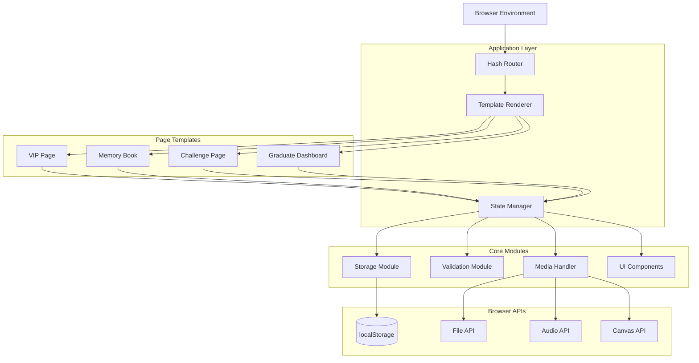
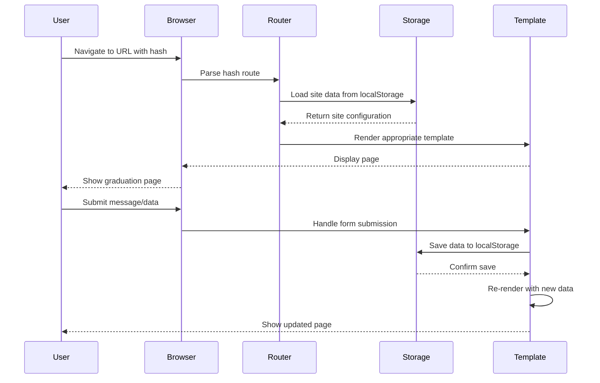

# Design Document: Graduation VIP Website

## Overview

The Graduation VIP Website is a client-side web application built entirely with vanilla HTML, CSS, and JavaScript. The system provides graduates with three distinct page templates to celebrate their graduation milestone: a VIP Page with countdown and guest messages, a Memory Book with page-turning interface, and a Challenge Page with interactive questions.

### Key Design Constraints

- **No Backend**: All functionality runs in the browser (client-side only)
- **No Frameworks**: Pure HTML, CSS, and JavaScript without external libraries
- **Local Storage**: All data persists using browser localStorage API
- **Static Hosting**: Can be deployed on any static file server

### Core Capabilities

1. **Subdomain Simulation**: Uses URL hash routing to simulate personalized subdomains
2. **Template System**: Three distinct page layouts with shared components
3. **Data Persistence**: localStorage-based storage with JSON serialization
4. **Media Handling**: Client-side image processing and audio playback
5. **Responsive Design**: CSS-based responsive layouts for all screen sizes

## Architecture

### System Architecture



### Application Flow



### Module Organization

```
graduation-vip-website/
├── index.html              # Entry point with router
├── css/
│   ├── base.css           # Reset and base styles
│   ├── theme.css          # Colors, typography, variables
│   ├── components.css     # Reusable UI components
│   ├── vip-page.css       # VIP template styles
│   ├── memory-book.css    # Memory Book template styles
│   ├── challenge-page.css # Challenge template styles
│   └── dashboard.css      # Dashboard styles
├── js/
│   ├── app.js             # Application initialization
│   ├── router.js          # Hash-based routing
│   ├── storage.js         # localStorage abstraction
│   ├── validation.js      # Input validation
│   ├── media-handler.js   # Image and audio processing
│   ├── state-manager.js   # Application state management
│   ├── templates/
│   │   ├── vip-page.js    # VIP Page template
│   │   ├── memory-book.js # Memory Book template
│   │   ├── challenge-page.js # Challenge Page template
│   │   └── dashboard.js   # Dashboard template
│   └── components/
│       ├── countdown.js   # Countdown timer component
│       ├── message-box.js # Message display component
│       ├── gallery.js     # Photo gallery component
│       ├── audio-player.js # Background music player
│       └── qr-generator.js # QR code generator
└── assets/
    ├── images/
    │   ├── default-avatar.png
    │   └── university-bg.jpg
    └── audio/
        └── default-music.mp3
```

## Components and Interfaces

### 1. Router Module

**Purpose**: Manages navigation between different pages using URL hash routing.

**Interface**:
```javascript
// Router API
Router.init()
Router.navigate(route)
Router.getCurrentRoute()
Router.onRouteChange(callback)
```

**Routes**:
- `#/` - Landing page (subdomain creation)
- `#/{subdomain}` - Graduate's public page
- `#/{subdomain}/dashboard` - Graduate's private dashboard
- `#/{subdomain}/setup` - Initial setup wizard

**Implementation Strategy**:
- Listen to `hashchange` event
- Parse hash to extract subdomain and page type
- Load corresponding template and data
- Update browser history

### 2. Storage Module

**Purpose**: Abstracts localStorage operations with JSON serialization and error handling.

**Interface**:
```javascript
// Storage API
Storage.saveSite(subdomain, siteData)
Storage.loadSite(subdomain)
Storage.deleteSite(subdomain)
Storage.siteExists(subdomain)
Storage.getAllSubdomains()
Storage.saveMessage(subdomain, message)
Storage.getMessages(subdomain)
Storage.incrementVisitorCount(subdomain)
Storage.getVisitorCount(subdomain)
```

**Data Structure**:
```javascript
{
  "sites": {
    "ahmad2024": {
      "subdomain": "ahmad2024",
      "template": "vip-page",
      "graduateData": {
        "name": "أحمد",
        "photo": "data:image/jpeg;base64,...",
        "welcomeMessage": "مرحباً بكم في حفل تخرجي",
        "graduationDate": "2024-06-15T10:00:00Z",
        "successQuote": "النهاية مجرد بداية جديدة",
        "universityPhotos": ["data:image/jpeg;base64,..."],
        "backgroundMusic": "data:audio/mp3;base64,..."
      },
      "messages": [
        {
          "id": "msg_1",
          "text": "مبروك التخرج",
          "timestamp": "2024-05-01T14:30:00Z",
          "type": "guest-message"
        }
      ],
      "challengeResponses": [
        {
          "id": "resp_1",
          "firstImpression": "شخص طموح",
          "memorableMoment": "يوم المشروع النهائي",
          "finalWords": "بالتوفيق دائماً",
          "rating": 10,
          "timestamp": "2024-05-02T16:45:00Z"
        }
      ],
      "visitorCount": 42,
      "createdAt": "2024-04-01T12:00:00Z"
    }
  }
}
```

**Storage Limits**:
- localStorage typically provides 5-10MB per origin
- Images stored as base64 (increases size by ~33%)
- Implement size checking before storage
- Provide user feedback when approaching limits

### 3. Validation Module

**Purpose**: Validates all user inputs according to requirements.

**Interface**:
```javascript
// Validation API
Validation.validateSubdomain(subdomain)
Validation.validateMessage(text, maxLength)
Validation.validateImage(file, maxSize)
Validation.validateAudio(file, maxSize)
Validation.validateDate(dateString)
Validation.validateRating(rating)
```

**Validation Rules**:
- **Subdomain**: 3-50 alphanumeric characters
- **Messages**: 1-500 characters (VIP), 1-300 (Memory Book)
- **Images**: JPEG/PNG/WebP, max 5MB
- **Audio**: MP3/WAV, max 10MB
- **Rating**: Integer 1-10
- **Success Quote**: 1-200 characters

### 4. Media Handler Module

**Purpose**: Processes images and audio files for storage and display.

**Interface**:
```javascript
// Media Handler API
MediaHandler.processImage(file, maxWidth, maxHeight)
MediaHandler.createThumbnail(imageData, size)
MediaHandler.validateImageFormat(file)
MediaHandler.loadAudio(file)
MediaHandler.generateQRCode(url)
```

**Image Processing**:
- Read file using FileReader API
- Create Image element to load data
- Draw to Canvas with size constraints
- Export as base64 data URL
- Compress if needed to fit storage

**Audio Handling**:
- Convert to base64 for storage
- Create Audio element for playback
- Implement play/pause controls
- Remember playback state in sessionStorage

**QR Code Generation**:
- Implement QR code algorithm in pure JavaScript
- Generate as Canvas element
- Export as PNG data URL

### 5. State Manager Module

**Purpose**: Manages application state and coordinates between modules.

**Interface**:
```javascript
// State Manager API
StateManager.init()
StateManager.getCurrentSite()
StateManager.updateSite(updates)
StateManager.addMessage(message)
StateManager.addChallengeResponse(response)
StateManager.subscribe(callback)
StateManager.getState()
```

**State Structure**:
```javascript
{
  currentSubdomain: "ahmad2024",
  currentTemplate: "vip-page",
  siteData: { /* loaded from storage */ },
  isOwner: false,
  sessionId: "uuid-v4",
  musicPlaying: false,
  currentPage: 0 // for memory book
}
```

### 6. Template Components

#### VIP Page Template

**Features**:
- Graduate profile display (photo + welcome message)
- Countdown timer to graduation
- Success quote display
- University photo gallery
- Guest message collection
- Background music player

**Component Structure**:
```javascript
VIPPage.render(siteData)
VIPPage.initCountdown(graduationDate)
VIPPage.initGallery(photos)
VIPPage.initMessageBox(messages)
VIPPage.initAudioPlayer(audioData)
```

#### Memory Book Template

**Features**:
- Book-like interface with page-turning animation
- Each message on separate page
- Navigation controls (previous/next)
- Decorative page styling
- Invitation page when empty

**Component Structure**:
```javascript
MemoryBook.render(messages)
MemoryBook.turnPage(direction)
MemoryBook.goToPage(pageNumber)
MemoryBook.addMessage(message)
```

**Page Turn Animation**:
- CSS 3D transforms for page flip effect
- Transition duration: 0.6s
- Preserve-3d for realistic depth

#### Challenge Page Template

**Features**:
- Four question form
- Text inputs for three questions
- Rating slider (1-10)
- Response list display
- Form validation

**Component Structure**:
```javascript
ChallengePage.render(responses)
ChallengePage.initForm()
ChallengePage.submitResponse(data)
ChallengePage.displayResponses(responses)
```

#### Dashboard Template

**Features**:
- Authentication check
- Site statistics display
- Message management
- Content editing
- QR code generation
- Share functionality

**Component Structure**:
```javascript
Dashboard.render(siteData, stats)
Dashboard.initAuth()
Dashboard.editProfile()
Dashboard.viewMessages()
Dashboard.generateQRCode()
Dashboard.copyShareLink()
```

### 7. UI Components

#### Countdown Timer Component

**Purpose**: Displays time remaining until graduation.

```javascript
Countdown.init(targetDate, elementId)
Countdown.update()
Countdown.stop()
```

**Display Format**:
- Days: Hours: Minutes: Seconds
- Updates every second
- Shows congratulations when date passed

#### Message Box Component

**Purpose**: Displays and manages guest messages.

```javascript
MessageBox.render(messages, containerId)
MessageBox.addMessage(message)
MessageBox.formatTimestamp(timestamp)
```

**Features**:
- Chronological order display
- Relative timestamps (e.g., "2 hours ago")
- Smooth scroll to new messages
- Empty state message

#### Gallery Component

**Purpose**: Displays university photos in grid/carousel.

```javascript
Gallery.render(photos, containerId)
Gallery.openLightbox(photoIndex)
Gallery.closeLightbox()
Gallery.navigate(direction)
```

**Features**:
- Responsive grid layout
- Click to enlarge (lightbox)
- Keyboard navigation
- Lazy loading for performance

#### Audio Player Component

**Purpose**: Manages background music playback.

```javascript
AudioPlayer.init(audioData, autoplay)
AudioPlayer.play()
AudioPlayer.pause()
AudioPlayer.setVolume(level)
```

**Features**:
- Auto-play on page load
- Play/pause toggle button
- Volume control
- Loop playback
- Session state persistence

## Data Models

### Site Model

```javascript
{
  subdomain: String,           // Unique identifier (3-50 alphanumeric)
  template: String,            // "vip-page" | "memory-book" | "challenge-page"
  graduateData: {
    name: String,              // Graduate's name
    photo: String,             // Base64 data URL or null
    welcomeMessage: String,    // Custom welcome text
    graduationDate: String,    // ISO 8601 date string
    successQuote: String,      // Inspirational quote (max 200 chars)
    universityPhotos: [String], // Array of base64 data URLs (3-10 images)
    backgroundMusic: String    // Base64 audio data URL or null
  },
  messages: [Message],         // Array of guest messages
  challengeResponses: [ChallengeResponse], // Array of challenge responses
  visitorCount: Number,        // Total unique visitors
  createdAt: String,           // ISO 8601 creation timestamp
  updatedAt: String            // ISO 8601 last update timestamp
}
```

### Message Model

```javascript
{
  id: String,                  // Unique message ID (e.g., "msg_" + timestamp)
  text: String,                // Message content (1-500 chars for VIP, 1-300 for Memory Book)
  timestamp: String,           // ISO 8601 submission timestamp
  type: String                 // "guest-message" | "memory-book-entry"
}
```

### Challenge Response Model

```javascript
{
  id: String,                  // Unique response ID (e.g., "resp_" + timestamp)
  firstImpression: String,     // Answer to "What was your first impression?"
  memorableMoment: String,     // Answer to "Most memorable moment together?"
  finalWords: String,          // Answer to "Final words for the graduate?"
  rating: Number,              // Rating from 1-10
  timestamp: String            // ISO 8601 submission timestamp
}
```

### Session Model

```javascript
{
  sessionId: String,           // UUID v4 for visitor tracking
  visitedSites: [String],      // Array of subdomains visited this session
  musicPreferences: {          // Per-site music state
    [subdomain]: Boolean       // true = playing, false = paused
  },
  createdAt: String            // Session start timestamp
}
```

### Validation Constraints

| Field | Type | Min | Max | Pattern | Required |
|-------|------|-----|-----|---------|----------|
| subdomain | String | 3 | 50 | ^[a-zA-Z0-9]+$ | Yes |
| name | String | 1 | 100 | - | Yes |
| welcomeMessage | String | 0 | 1000 | - | No |
| successQuote | String | 0 | 200 | - | No |
| graduationDate | String | - | - | ISO 8601 | Yes |
| message.text | String | 1 | 500 | - | Yes |
| memoryBook.text | String | 1 | 300 | - | Yes |
| rating | Number | 1 | 10 | Integer | Yes |
| image | File | - | 5MB | JPEG/PNG/WebP | No |
| audio | File | - | 10MB | MP3/WAV | No |


## Correctness Properties

*A property is a characteristic or behavior that should hold true across all valid executions of a system—essentially, a formal statement about what the system should do. Properties serve as the bridge between human-readable specifications and machine-verifiable correctness guarantees.*

### Property 1: Subdomain Format Generation

*For any* valid name and year combination, the generated subdomain SHALL match the format {name}{year}.graduation.site

**Validates: Requirements 1.1**

### Property 2: Subdomain Alphanumeric Validation

*For any* string input, the subdomain validation SHALL accept only strings containing exclusively alphanumeric characters (a-z, A-Z, 0-9)

**Validates: Requirements 1.2**

### Property 3: Subdomain Uniqueness Check

*For any* subdomain and existing storage state, the uniqueness check SHALL correctly identify whether the subdomain already exists and return appropriate error when it does

**Validates: Requirements 1.3**

### Property 4: Input Length Validation

*For any* text input field with defined length constraints (subdomain 3-50, message 1-500, memory book 1-300, quote 1-200), the validation SHALL accept inputs within bounds and reject inputs outside bounds

**Validates: Requirements 1.4, 5.3, 8.3, 9.5, 7.2**

### Property 5: Data Persistence Round-Trip

*For any* valid site data (including subdomain, template selection, graduate data, messages, and visitor count), storing the data and then retrieving it SHALL produce equivalent data with all fields preserved

**Validates: Requirements 1.5, 2.4, 5.4, 16.1, 16.2, 16.5, 20.5**

### Property 6: Template Selection Mapping

*For any* template selection (VIP_Page, Memory_Book, or Challenge_Page), the system SHALL load and render the corresponding template module correctly

**Validates: Requirements 2.2**

### Property 7: File Format and Size Validation

*For any* uploaded file (image or audio), the validation SHALL correctly accept files matching allowed formats (JPEG/PNG/WebP for images up to 5MB, MP3/WAV for audio up to 10MB) and reject files that don't match

**Validates: Requirements 3.3, 6.3, 7.4**

### Property 8: Image Aspect Ratio Preservation

*For any* image with original dimensions, the resizing operation SHALL produce an output image that maintains the original aspect ratio while fitting within the specified display constraints

**Validates: Requirements 3.4**

### Property 9: Date Calculation Accuracy

*For any* future graduation date, the time remaining calculation SHALL accurately compute the difference between the current moment and the graduation date in days, hours, minutes, and seconds

**Validates: Requirements 4.2**

### Property 10: Past Date Conditional Display

*For any* graduation date that is in the past or is the current date, the system SHALL display a congratulatory message instead of a countdown timer

**Validates: Requirements 4.4**

### Property 11: Date String Validation

*For any* date string input, the validation SHALL correctly identify valid ISO 8601 date formats and reject invalid formats

**Validates: Requirements 4.5**

### Property 12: Message Chronological Ordering

*For any* collection of messages with timestamps, the display order SHALL be chronological (oldest to newest or newest to oldest consistently)

**Validates: Requirements 5.5**

### Property 13: Session State Persistence

*For any* music playback state (playing or paused), storing the state in session storage and retrieving it SHALL preserve the exact state

**Validates: Requirements 6.5**

### Property 14: Photo Gallery Array Length Validation

*For any* array of university photos, the validation SHALL accept arrays with 3 to 10 elements and reject arrays outside this range

**Validates: Requirements 7.2**

### Property 15: Memory Book Page Creation

*For any* submitted message in Memory Book template, the system SHALL create a new page entry that can be navigated to

**Validates: Requirements 9.2**

### Property 16: Challenge Response Storage Integrity

*For any* set of four challenge answers (first impression, memorable moment, final words, rating), the system SHALL store all four answers together as a single response entry

**Validates: Requirements 10.4**

### Property 17: Challenge Form Completeness Validation

*For any* challenge form state, the validation SHALL require all four fields to be non-empty before allowing submission

**Validates: Requirements 10.6**

### Property 18: Empty Message Rejection

*For any* string that is empty or contains only whitespace characters, the message validation SHALL reject the input and prevent storage

**Validates: Requirements 12.1, 12.2**

### Property 19: Whitespace Trimming Preservation

*For any* message string with leading or trailing whitespace, the system SHALL trim the whitespace before storage while preserving internal whitespace and line breaks

**Validates: Requirements 12.3, 12.4**

### Property 20: Length Limit Error Messaging

*For any* input that exceeds its defined character limit, the validation SHALL return an error message indicating the maximum allowed length

**Validates: Requirements 12.5**

### Property 21: Image Compression Size Reduction

*For any* image file, the compression operation SHALL produce an output file that is smaller in size than the input while maintaining the same dimensions

**Validates: Requirements 13.2**

### Property 22: QR Code URL Encoding

*For any* valid URL string, the QR code generation SHALL produce a QR code that, when scanned, decodes to the exact original URL

**Validates: Requirements 17.4**

### Property 23: Message Timestamp Recording

*For any* submitted message, the system SHALL record a valid ISO 8601 timestamp representing the submission time

**Validates: Requirements 18.1**

### Property 24: Timestamp Format Conversion

*For any* valid timestamp, the formatting function SHALL produce a human-readable string, with relative time format (e.g., "2 hours ago") for timestamps within 7 days and absolute date format for older timestamps

**Validates: Requirements 18.2, 18.3, 18.4**

### Property 25: Timezone Localization

*For any* UTC timestamp, the display function SHALL convert it to the visitor's local timezone correctly

**Validates: Requirements 18.5**

### Property 26: Message and Visitor Count Accuracy

*For any* collection of messages and visitor sessions, the counting function SHALL return the exact number of items in each collection

**Validates: Requirements 19.4**

### Property 27: Visitor Counter Increment

*For any* sequence of page visits, the visitor counter SHALL increment by exactly one for each visit

**Validates: Requirements 20.1**

### Property 28: Unique Visitor Counting

*For any* collection of visitor sessions with some duplicate session IDs, the unique visitor count SHALL equal the number of distinct session IDs

**Validates: Requirements 20.3**

### Property 29: Owner Visit Exclusion

*For any* collection of visits that includes visits from the site owner, the visitor counter SHALL exclude owner visits and count only non-owner visits

**Validates: Requirements 20.4**

## Error Handling

### Error Categories

1. **Validation Errors**: User input that doesn't meet requirements
2. **Storage Errors**: localStorage quota exceeded or unavailable
3. **Media Errors**: File processing failures
4. **Browser Compatibility Errors**: Unsupported features

### Error Handling Strategy

#### Validation Errors

**Approach**: Prevent invalid data from entering the system through client-side validation.

**Implementation**:
```javascript
// Example validation error handling
function validateSubdomain(subdomain) {
  const errors = [];
  
  if (!subdomain || subdomain.length < 3) {
    errors.push({ field: 'subdomain', message: 'يجب أن يكون النطاق 3 أحرف على الأقل' });
  }
  
  if (subdomain.length > 50) {
    errors.push({ field: 'subdomain', message: 'يجب أن لا يتجاوز النطاق 50 حرف' });
  }
  
  if (!/^[a-zA-Z0-9]+$/.test(subdomain)) {
    errors.push({ field: 'subdomain', message: 'يجب أن يحتوي النطاق على أحرف وأرقام فقط' });
  }
  
  return {
    valid: errors.length === 0,
    errors: errors
  };
}
```

**User Feedback**:
- Display inline error messages next to form fields
- Use red color and error icon for visibility
- Provide specific, actionable error messages in Arabic
- Prevent form submission until errors are resolved

#### Storage Errors

**Approach**: Gracefully handle localStorage limitations and failures.

**Common Scenarios**:
1. **Quota Exceeded**: localStorage limit reached (typically 5-10MB)
2. **Storage Unavailable**: Private browsing mode or disabled localStorage
3. **Data Corruption**: Invalid JSON in storage

**Implementation**:
```javascript
function safeStorageSave(key, data) {
  try {
    const serialized = JSON.stringify(data);
    
    // Check available space
    const estimatedSize = new Blob([serialized]).size;
    if (estimatedSize > 5 * 1024 * 1024) { // 5MB warning
      return {
        success: false,
        error: 'QUOTA_WARNING',
        message: 'البيانات كبيرة جداً. يرجى تقليل حجم الصور.'
      };
    }
    
    localStorage.setItem(key, serialized);
    return { success: true };
    
  } catch (e) {
    if (e.name === 'QuotaExceededError') {
      return {
        success: false,
        error: 'QUOTA_EXCEEDED',
        message: 'مساحة التخزين ممتلئة. يرجى حذف بعض البيانات.'
      };
    }
    
    return {
      success: false,
      error: 'STORAGE_ERROR',
      message: 'حدث خطأ في حفظ البيانات. يرجى المحاولة مرة أخرى.'
    };
  }
}

function safeStorageLoad(key) {
  try {
    const data = localStorage.getItem(key);
    if (!data) return { success: true, data: null };
    
    const parsed = JSON.parse(data);
    return { success: true, data: parsed };
    
  } catch (e) {
    return {
      success: false,
      error: 'PARSE_ERROR',
      message: 'البيانات المحفوظة تالفة.'
    };
  }
}
```

**User Feedback**:
- Show modal dialog for critical storage errors
- Provide guidance on how to free up space
- Offer option to download data as backup before clearing
- Suggest using smaller images or fewer photos

#### Media Processing Errors

**Approach**: Handle file upload and processing failures gracefully.

**Common Scenarios**:
1. **Invalid File Type**: User uploads unsupported format
2. **File Too Large**: Exceeds size limits
3. **Processing Failure**: Image/audio processing fails
4. **Corrupted File**: File cannot be read

**Implementation**:
```javascript
async function processImageUpload(file) {
  // Validate file type
  const validTypes = ['image/jpeg', 'image/png', 'image/webp'];
  if (!validTypes.includes(file.type)) {
    return {
      success: false,
      error: 'INVALID_TYPE',
      message: 'نوع الملف غير مدعوم. يرجى استخدام JPEG أو PNG أو WebP'
    };
  }
  
  // Validate file size
  const maxSize = 5 * 1024 * 1024; // 5MB
  if (file.size > maxSize) {
    return {
      success: false,
      error: 'FILE_TOO_LARGE',
      message: 'حجم الصورة كبير جداً. الحد الأقصى 5 ميجابايت'
    };
  }
  
  try {
    // Process image
    const dataUrl = await readFileAsDataURL(file);
    const resized = await resizeImage(dataUrl, 1200, 1200);
    
    return {
      success: true,
      data: resized
    };
    
  } catch (e) {
    return {
      success: false,
      error: 'PROCESSING_ERROR',
      message: 'فشل معالجة الصورة. يرجى المحاولة بصورة أخرى'
    };
  }
}
```

**User Feedback**:
- Show progress indicator during file upload
- Display clear error messages for file issues
- Suggest alternatives (compress image, use different format)
- Allow retry without losing other form data

#### Browser Compatibility Errors

**Approach**: Detect unsupported features and provide fallbacks or guidance.

**Feature Detection**:
```javascript
function checkBrowserSupport() {
  const features = {
    localStorage: typeof Storage !== 'undefined',
    fileReader: typeof FileReader !== 'undefined',
    audio: typeof Audio !== 'undefined',
    canvas: !!document.createElement('canvas').getContext,
    flexbox: CSS.supports('display', 'flex'),
    grid: CSS.supports('display', 'grid')
  };
  
  const unsupported = Object.entries(features)
    .filter(([key, supported]) => !supported)
    .map(([key]) => key);
  
  return {
    supported: unsupported.length === 0,
    unsupported: unsupported
  };
}

function showBrowserWarning() {
  const support = checkBrowserSupport();
  
  if (!support.supported) {
    const message = `
      متصفحك لا يدعم بعض الميزات المطلوبة.
      يرجى استخدام أحدث إصدار من Chrome أو Firefox أو Safari أو Edge.
      الميزات غير المدعومة: ${support.unsupported.join(', ')}
    `;
    
    // Display warning banner
    showWarningBanner(message);
  }
}
```

**User Feedback**:
- Show warning banner for unsupported browsers
- Recommend modern browser alternatives
- Provide graceful degradation where possible
- Document minimum browser requirements

### Error Recovery Strategies

1. **Auto-save Draft**: Save form data to sessionStorage to prevent data loss
2. **Retry Logic**: Automatically retry failed operations with exponential backoff
3. **Fallback Values**: Use default values when data is missing or corrupted
4. **Data Export**: Allow users to export their data before clearing storage
5. **Clear Instructions**: Provide step-by-step guidance for resolving errors

### Error Logging

Since this is a client-side only application, implement console logging for debugging:

```javascript
const Logger = {
  error: (context, error, details) => {
    console.error(`[${context}]`, error, details);
    // Could also store in localStorage for later review
  },
  
  warn: (context, message, details) => {
    console.warn(`[${context}]`, message, details);
  },
  
  info: (context, message) => {
    console.info(`[${context}]`, message);
  }
};
```

## Testing Strategy

### Testing Approach

This project requires a **dual testing approach** combining property-based testing for core logic and example-based testing for UI components and integrations.

### Property-Based Testing

**Library Selection**: Since we cannot use external libraries, we will implement a minimal property-based testing framework in pure JavaScript.

**Framework Structure**:
```javascript
// Simple property-based testing framework
const PBT = {
  // Run a property test with generated inputs
  forAll: function(generator, property, iterations = 100) {
    const failures = [];
    
    for (let i = 0; i < iterations; i++) {
      const input = generator();
      const result = property(input);
      
      if (!result.pass) {
        failures.push({
          iteration: i,
          input: input,
          reason: result.reason
        });
      }
    }
    
    return {
      passed: failures.length === 0,
      failures: failures,
      iterations: iterations
    };
  }
};

// Example generators
const Generators = {
  alphanumeric: (minLen, maxLen) => {
    return () => {
      const length = Math.floor(Math.random() * (maxLen - minLen + 1)) + minLen;
      const chars = 'abcdefghijklmnopqrstuvwxyzABCDEFGHIJKLMNOPQRSTUVWXYZ0123456789';
      let result = '';
      for (let i = 0; i < length; i++) {
        result += chars.charAt(Math.floor(Math.random() * chars.length));
      }
      return result;
    };
  },
  
  string: (minLen, maxLen) => {
    return () => {
      const length = Math.floor(Math.random() * (maxLen - minLen + 1)) + minLen;
      return Array.from({ length }, () => 
        String.fromCharCode(Math.floor(Math.random() * 128))
      ).join('');
    };
  },
  
  integer: (min, max) => {
    return () => Math.floor(Math.random() * (max - min + 1)) + min;
  },
  
  date: (startYear, endYear) => {
    return () => {
      const start = new Date(startYear, 0, 1).getTime();
      const end = new Date(endYear, 11, 31).getTime();
      return new Date(start + Math.random() * (end - start)).toISOString();
    };
  },
  
  array: (elementGenerator, minLen, maxLen) => {
    return () => {
      const length = Math.floor(Math.random() * (maxLen - minLen + 1)) + minLen;
      return Array.from({ length }, elementGenerator);
    };
  }
};
```

**Property Test Examples**:

```javascript
// Property 1: Subdomain Format Generation
test('Property 1: Subdomain Format Generation', () => {
  const result = PBT.forAll(
    () => ({
      name: Generators.alphanumeric(3, 20)(),
      year: Generators.integer(2020, 2030)()
    }),
    ({ name, year }) => {
      const subdomain = generateSubdomain(name, year);
      const expected = `${name}${year}.graduation.site`;
      return {
        pass: subdomain === expected,
        reason: `Expected ${expected}, got ${subdomain}`
      };
    },
    100
  );
  
  expect(result.passed).toBe(true);
});

// Property 4: Input Length Validation
test('Property 4: Input Length Validation', () => {
  const result = PBT.forAll(
    Generators.string(0, 100),
    (input) => {
      const validation = validateLength(input, 3, 50);
      const shouldPass = input.length >= 3 && input.length <= 50;
      return {
        pass: validation.valid === shouldPass,
        reason: `Input length ${input.length}, expected valid=${shouldPass}, got valid=${validation.valid}`
      };
    },
    100
  );
  
  expect(result.passed).toBe(true);
});

// Property 5: Data Persistence Round-Trip
test('Property 5: Data Persistence Round-Trip', () => {
  const result = PBT.forAll(
    () => ({
      subdomain: Generators.alphanumeric(3, 20)(),
      template: ['vip-page', 'memory-book', 'challenge-page'][Math.floor(Math.random() * 3)],
      graduateData: {
        name: Generators.string(1, 50)(),
        welcomeMessage: Generators.string(0, 500)()
      }
    }),
    (siteData) => {
      // Save to mock storage
      const saved = Storage.saveSite(siteData.subdomain, siteData);
      if (!saved.success) {
        return { pass: false, reason: 'Save failed' };
      }
      
      // Retrieve from storage
      const loaded = Storage.loadSite(siteData.subdomain);
      if (!loaded.success) {
        return { pass: false, reason: 'Load failed' };
      }
      
      // Compare
      const match = JSON.stringify(siteData) === JSON.stringify(loaded.data);
      return {
        pass: match,
        reason: match ? '' : 'Data mismatch after round-trip'
      };
    },
    100
  );
  
  expect(result.passed).toBe(true);
});
```

**Property Test Configuration**:
- **Minimum iterations**: 100 per property test
- **Test tagging**: Each test references its design property
- **Tag format**: `Feature: graduation-vip-website, Property {number}: {property_text}`

### Example-Based Unit Testing

**Purpose**: Test specific scenarios, UI components, and edge cases.

**Test Structure**:
```javascript
// Example: VIP Page rendering
test('VIP Page displays graduate photo', () => {
  const siteData = {
    template: 'vip-page',
    graduateData: {
      photo: 'data:image/jpeg;base64,/9j/4AAQ...',
      name: 'أحمد'
    }
  };
  
  const rendered = VIPPage.render(siteData);
  const photoElement = rendered.querySelector('.graduate-photo');
  
  expect(photoElement).toBeTruthy();
  expect(photoElement.src).toBe(siteData.graduateData.photo);
});

// Example: Empty message rejection
test('Empty messages are rejected', () => {
  const emptyMessages = ['', '   ', '\t\n', '     \n\t  '];
  
  emptyMessages.forEach(msg => {
    const validation = validateMessage(msg);
    expect(validation.valid).toBe(false);
    expect(validation.errors).toContain('Message cannot be empty');
  });
});

// Example: Countdown timer display
test('Countdown shows congratulations for past dates', () => {
  const pastDate = new Date('2020-01-01').toISOString();
  const display = Countdown.getDisplay(pastDate);
  
  expect(display.type).toBe('congratulations');
  expect(display.message).toContain('مبروك');
});
```

### Integration Testing

**Purpose**: Test interactions between modules and browser APIs.

**Test Scenarios**:
1. **localStorage Integration**: Verify data persists across page reloads
2. **File Upload Flow**: Test complete image upload and processing pipeline
3. **Audio Playback**: Verify background music plays and controls work
4. **Routing**: Test navigation between different pages
5. **Form Submission**: Test complete message submission flow

**Example Integration Test**:
```javascript
test('Complete message submission flow', async () => {
  // Setup: Create a site
  const subdomain = 'test2024';
  const siteData = createTestSite(subdomain);
  Storage.saveSite(subdomain, siteData);
  
  // Navigate to site
  Router.navigate(`#/${subdomain}`);
  await waitForRender();
  
  // Submit message
  const messageInput = document.querySelector('.message-input');
  const submitButton = document.querySelector('.message-submit');
  
  messageInput.value = 'مبروك التخرج!';
  submitButton.click();
  
  await waitForSubmission();
  
  // Verify message appears
  const messages = document.querySelectorAll('.message-item');
  expect(messages.length).toBe(1);
  expect(messages[0].textContent).toContain('مبروك التخرج!');
  
  // Verify message persisted
  const loaded = Storage.loadSite(subdomain);
  expect(loaded.data.messages.length).toBe(1);
  expect(loaded.data.messages[0].text).toBe('مبروك التخرج!');
});
```

### Manual Testing Checklist

**Cross-Browser Testing**:
- [ ] Chrome (latest version)
- [ ] Firefox (latest version)
- [ ] Safari (latest version)
- [ ] Edge (latest version)

**Responsive Testing**:
- [ ] Mobile (320px - 480px)
- [ ] Tablet (481px - 768px)
- [ ] Desktop (769px+)
- [ ] Orientation changes

**Accessibility Testing**:
- [ ] Keyboard navigation works
- [ ] Screen reader compatibility
- [ ] Color contrast meets WCAG AA
- [ ] Touch targets are 44px minimum

**Performance Testing**:
- [ ] Page loads within 3 seconds
- [ ] Images are optimized
- [ ] No layout shifts during load
- [ ] Smooth animations (60fps)

### Test Organization

```
tests/
├── unit/
│   ├── validation.test.js
│   ├── storage.test.js
│   ├── media-handler.test.js
│   └── components/
│       ├── countdown.test.js
│       ├── message-box.test.js
│       └── gallery.test.js
├── property/
│   ├── subdomain.property.test.js
│   ├── validation.property.test.js
│   ├── storage.property.test.js
│   └── timestamp.property.test.js
├── integration/
│   ├── message-flow.test.js
│   ├── template-rendering.test.js
│   └── routing.test.js
└── helpers/
    ├── generators.js
    ├── test-data.js
    └── mock-storage.js
```

### Test Coverage Goals

- **Core Logic**: 90%+ coverage with property tests
- **UI Components**: 80%+ coverage with unit tests
- **Integration Flows**: All critical paths tested
- **Edge Cases**: All identified edge cases have tests

### Continuous Testing

**Development Workflow**:
1. Write property test for new feature
2. Implement feature
3. Run property tests (100 iterations)
4. Write example tests for edge cases
5. Run full test suite
6. Manual testing in browsers

**Test Execution**:
- Run tests before each commit
- Run full suite including property tests before deployment
- Document any test failures with reproduction steps
